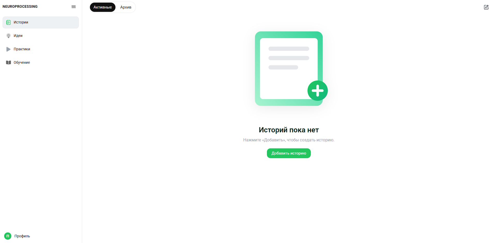
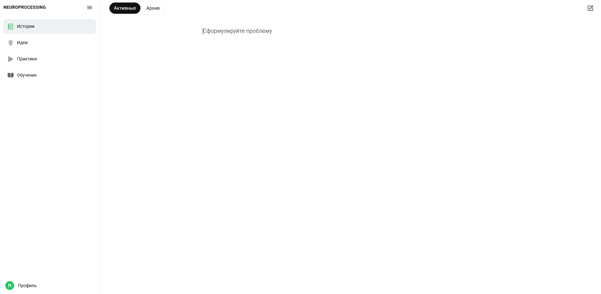
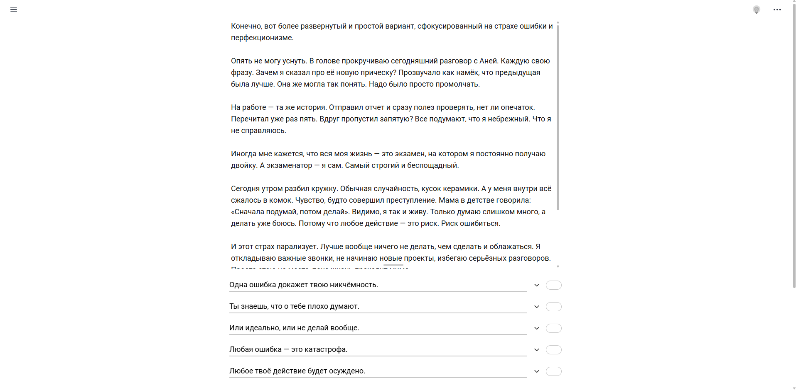
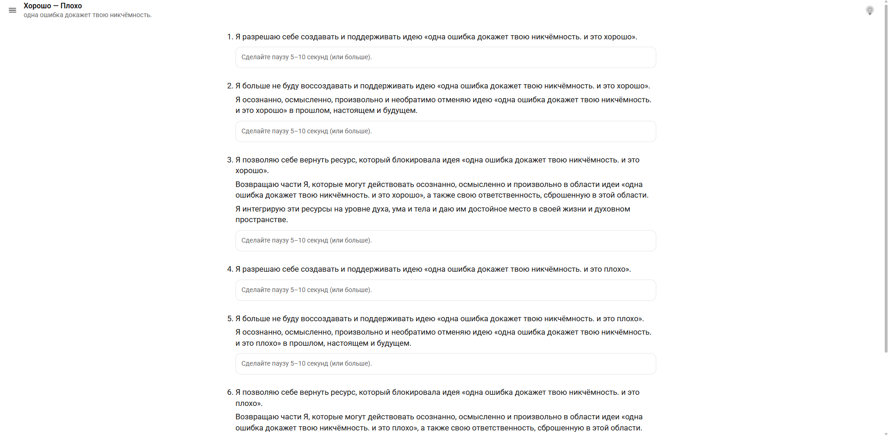

# Neuroprocessing --- веб‑приложение для историй, практик и обучения

**Neuroprocessing** --- это полнофункциональное веб‑приложение,
разработанное на основе **React, Node.js и PostgreSQL**, предназначенное
для работы с личными историями, фиксированием идей и выполнением
практик.\
Проект создан как реальное производственное приложение, развёрнутое на
сервере и доступное всем желающим по адресу:\
👉 **https://neuroprocessing.ru/**

## Описание проекта

Приложение объединяет несколько ключевых направлений пользовательской
активности:

### 🔐 Аутентификация

-   регистрация\
-   подтверждение email\
-   вход и выход из аккаунта\
-   восстановление пароля\
-   защита с помощью JWT (access/refresh)

### 📝 Истории

-   создание, редактирование и удаление историй\
-   подсветка и фиксация ключевых идей внутри текста\
-   локальное кеширование и оптимизация синхронизации\
-   автоматическое обновление в реальном времени через WebSocket

### 🏋️ Практики

-   выполнение структурированных практик\
-   синхронизация состояния в режиме реального времени\
-   продуманная логика для мобильных и десктопных сценариев

### 📱 Интерфейс и UX

-   полностью адаптивный дизайн\
-   оптимизация поведения под разные размеры экранов\
-   умная логика StoryText (авторесайз, автоскролл, сохранение
    состояния)\
-   удобная и лёгкая архитектура компонентов

## Скриншоты

### 1 --- Пустой список историй

### 2 --- Создание новой истории

### 3 --- Просмотр истории с фиксированными идеями

### 4 --- Прохождение практик

## Назначение проекта

Neuroprocessing создан как полноценное приложение, демонстрирующее весь
цикл веб‑разработки:\
от построения клиентской архитектуры и написания серверной логики до
работы с БД, real‑time каналами, безопасностью, оптимизацией UX и
деплоем на продакшен‑сервер.

Приложение функционирует в реальной рабочей среде и доступно по адресу:\
👉 **https://neuroprocessing.ru/**
